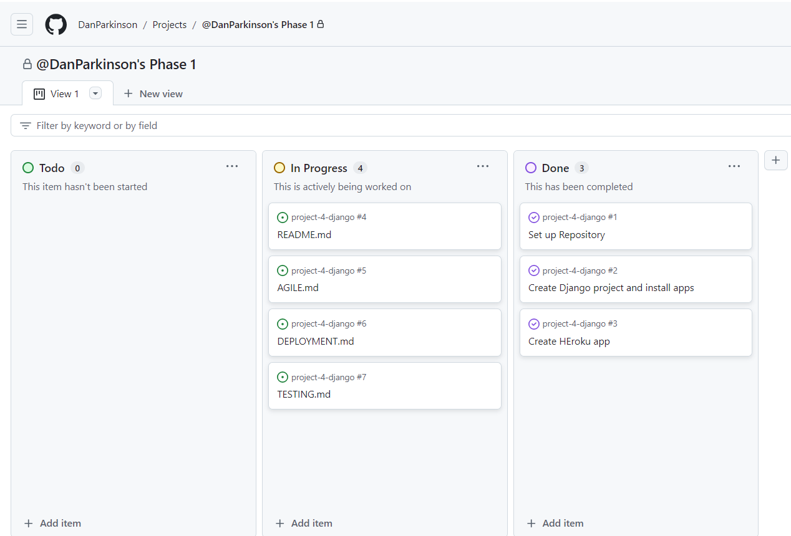
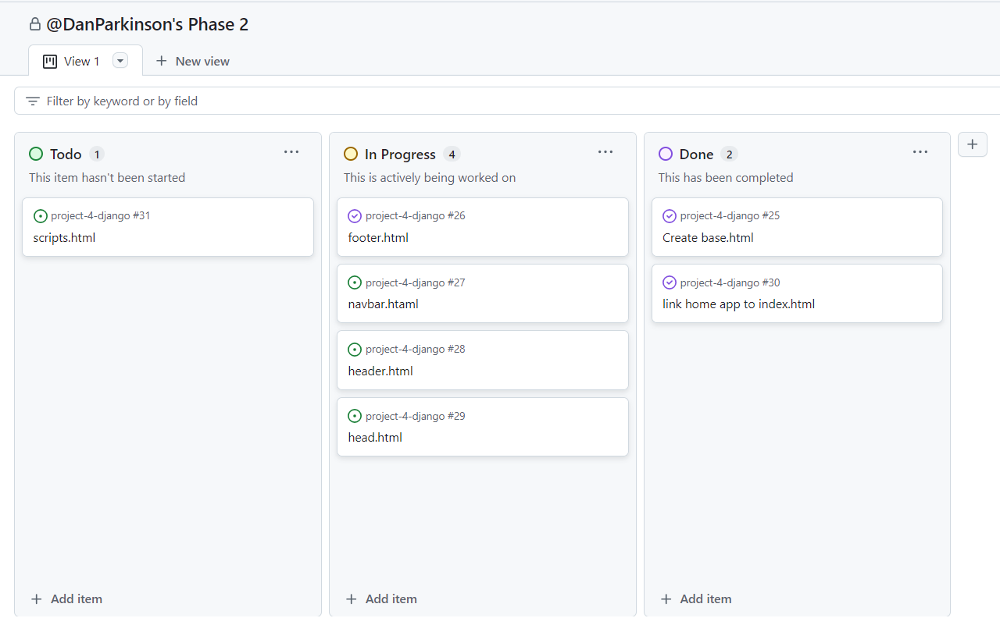
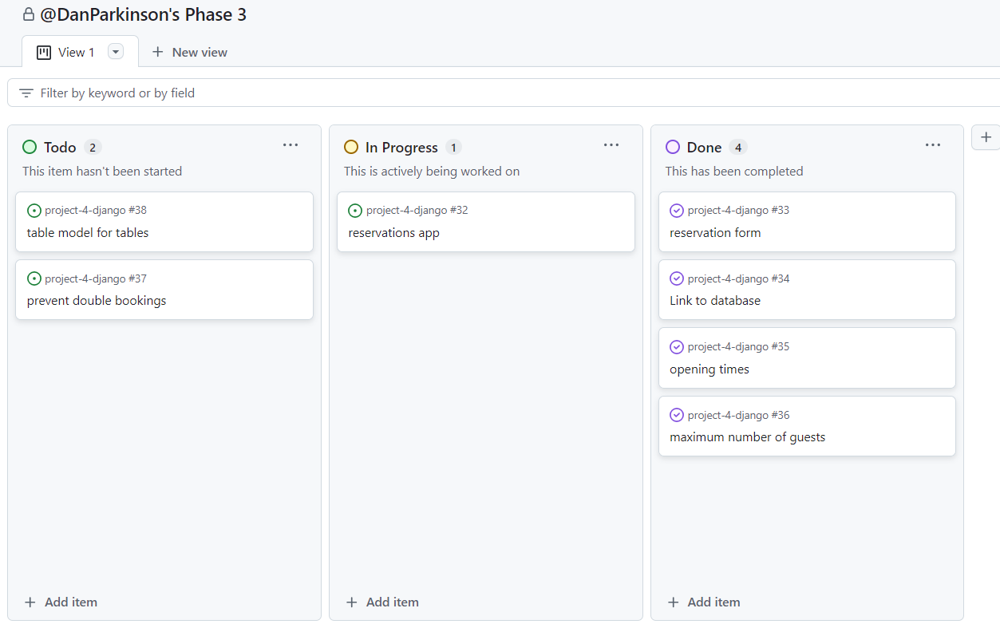
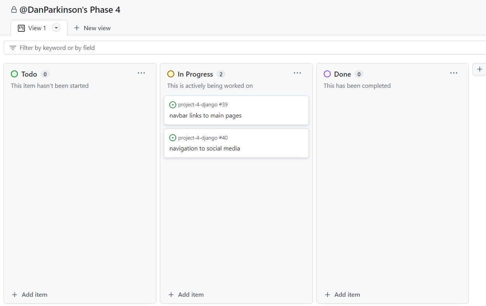
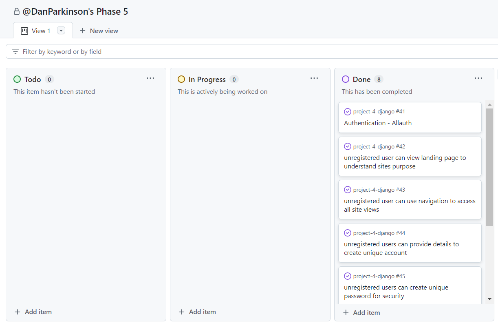

# AGILE

This is where I will document my agile approach. It will be set into phases to help me organise my work. After a few false starts where i found myself getting lost, this will help me document my thoughts. Because of the fault starts my README.md has already been created. 

## Phase 1

Click me

- Setup repo.
- Create Django project.
- Install basic dependencies and add to requirements.
- Create procfile to deploy to Heroku.
- Create app on Heroku.
- Link GitHub repo to Heroku app.
- Test to deploy working project ASAP.
- Document project creation and deployment.
- Perform design thinking exercise for features to include in project.
- Add user stories to readme.
- Add wireframes to readme.
- Mock up initial database design and document in readme.
- List and link technologies used in readme.
- Learn to use GitHub projects. Create user stories.

Still to do:
- Identify a colour schema to use in the site

## Phase 2

Click me

Focus for the next session is to do with setting up templates to have a view of the home page. As well as this I will create my user stories in github projects for Phase 1, phase 2 and my overall User Stories to outline the project. 

- Setup base.html.
- create separate components for site such as head, header, navbar, footer in a subfolder to inject into base.html.
- Setup index page in home app.
- Build navigation.
- Set up styling basics and check with deployed Heroku app.

With the templates linked, CSS and JS loading in the deployed version its time to make some models. Reservations will be first. 

## Phase 3

Click me

Focus for Phase 3 is creating a reservations model. I need a form for users to submit their reservations times. This needs to be saved to the database. I would like to create authentication but I need to research this a bit more as my understanding isnt quite where I would like it to be.

- forms needed for reservation submited
- model 
- views
- urls 

Now that I have a form to submit, a database to save the information and the admin panel is styled nicely. We need to add validation to the submittable form.

- Opening hours and 15 minute intervals
- Date that hasnt happened yet
- Number of people capped at 8 
- Phone numnber is a number 

The next step is to make sure that users cant double book. I will have to create a model for tables and connected them to bookings. This will be done at a later phase.

## Phase 4

Click me

Now that users can submit a reservation and it is saved to the database. I think navigation around the website will speed up processes. Time to fix the nav bar to include *Home, Make a Reservation, Login, Logout, SignUp, menu, about us.

I havent decided if logging in is actually necessary for this project as users can just get email confirmation of the booking. If users dont need to login then a cancellation/alteration page will be added for users to engage with. This means that the reservations will need a unique code for users to edit their information. 

The navbar has been set up with links to the homepage, make a reservation, about us and menu. Now for the social media icons to be linked to social accounts. 

I have decided to implement a login user function so the navbar will be updated with these once it is done. At this point the social media icons will be implemented into the footer. 

## phase 5 

Click me

This will be about user authentication using django AllAuth.

- Install `allauth` package.
- Add allauth to installed applications in settings.py.
- Add login/logout redirects back to index page.
- Perform migrations.
- Adapt navigation bar using Django Templates to to give registered/unregistered site users different menu options
- reservations can only be made by authenticated users. 
- Now the user needs to be linked with any reservation they make. simple edit to reservation model and views.
- This caused problems with the database so changed to sqlite3 adn remigrated.
- now to create users, reservation(That are hopefully linked to users) and create html that shows a logged in users reservations.
- Now to link the my_reservations page into the nav bar for authenticated users.

Now that users can authories themselves and they are connected to their reservations. Users now need to be able to updated or cancel a reservation if necessary. 

## Phase 6

Click me

- Logged in users can access their reservations using my_reservations.
- Next to the reservations should be a button called edit that brings them to an edit reservations form.
- Another button called delete reservation should be next to that which removes the reservations entirely.
- Users need access to only their reservations.

After creating the edit form reponse an error was thrown. Apparently i need a modelform to handle the data instead of a normal form as i am accessing the database. modelforms need a meta class. 

- Now that users can edit their reservations they need to be able to delete them.

- Users need to be able to see their reservations in date/time order on their reservation page

