# TESTING

A variety of exploratory tests were performed throughout the project.

## MANUAL TESTING

Getting the live deployed site working. This is well documented in the latter sections of [DEPLOYMENT.md](DEPLOYMENT.md)

## Checking website loads hompage

Click me

Add the following code to the home/views.py file. This tells the server to display "This is the homepage"

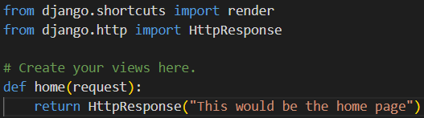

Add the following code to the elite_cuisine/urls.py file.

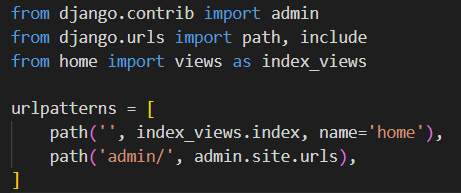

Add the following code to the elite_cuisine/settings.py file to installed apps.

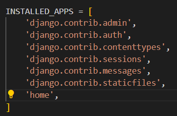

Use command python3 manage.py runserver to check the home app is linked correctly.

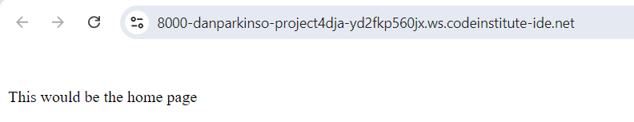

## Super User

Click me

When i originally tried to login as a superuser i recieved this error.

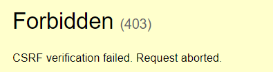

After using code institute support i had forgotten to add.

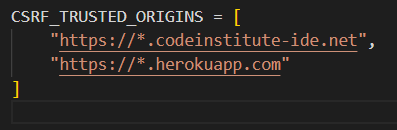

Admin login now functions correctly.

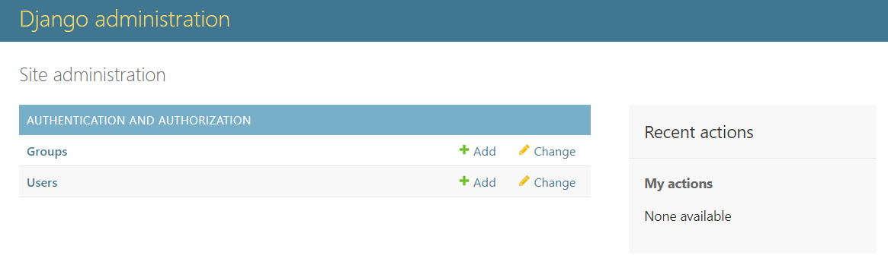

## Creating Templates 

Click me

Create a top level directory to include your templates 

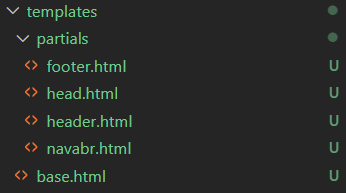

connect the templates directory to *elite/settings.py*

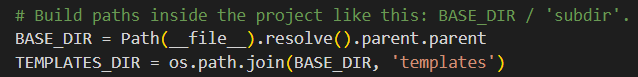

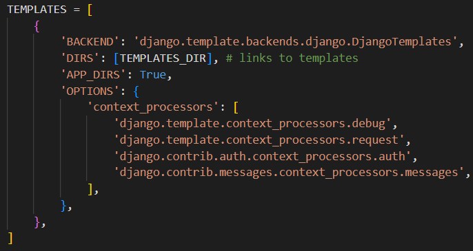

Once the templates partials are populated. The server looks like this

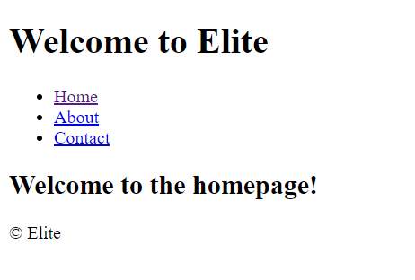

## Connecting CSS and JS

Click me

Connect the static directory to *elite/settings.py*.

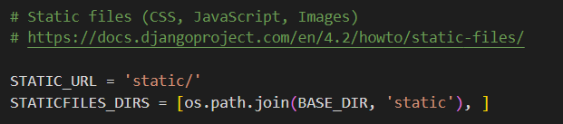

Create you style.css as shown at the top level.

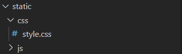

Edit head.html to load sytle sheet.

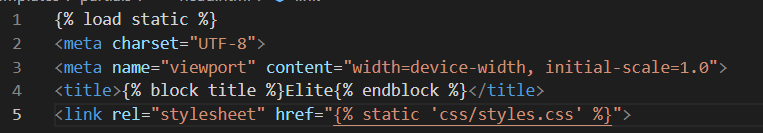

I initally recieved the error below. After chaging *STATIC_URL = '/static/'* in elite/setting.py the style sheet connected.

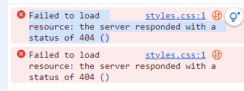

Server with backgorund colour.

Create script.js in static directory.

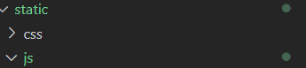

Connect script.js to base.html.

Check server loads message in developer tools.

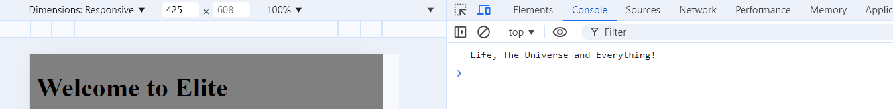

## Reservations app 

Click me

First I created the form to be able to submit a reservation and a success page

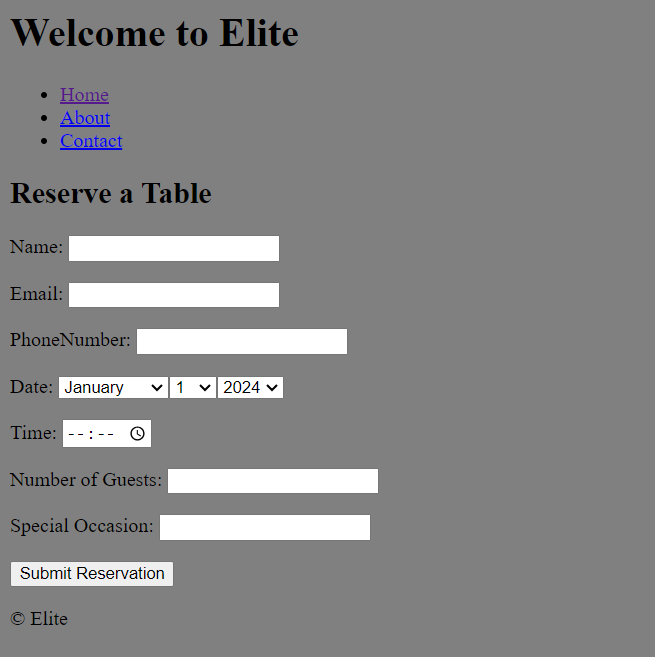

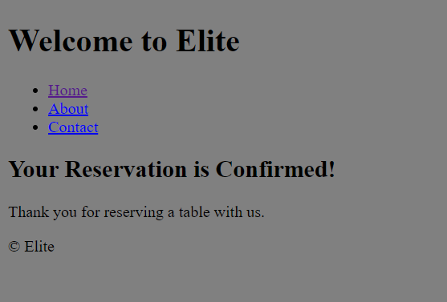

Now to create the link to the database. 

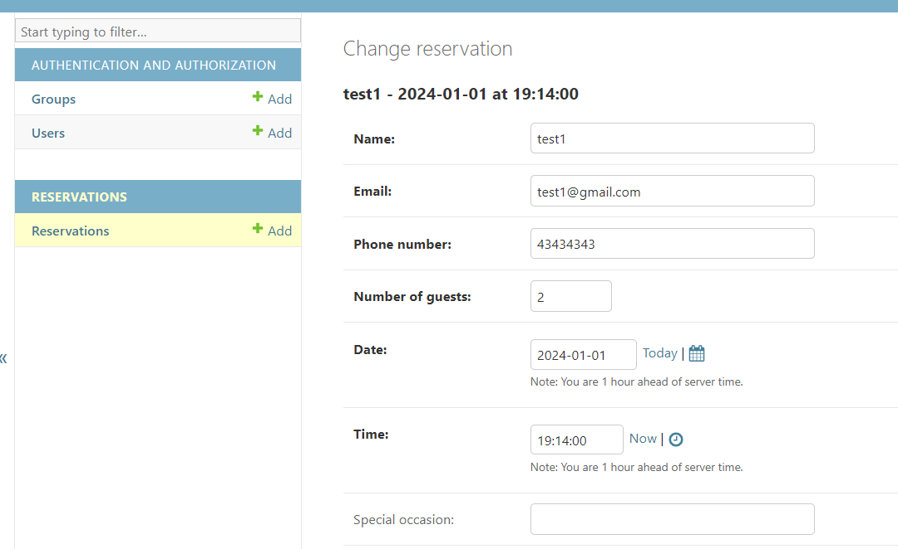

And to style the admin display so it is clearer

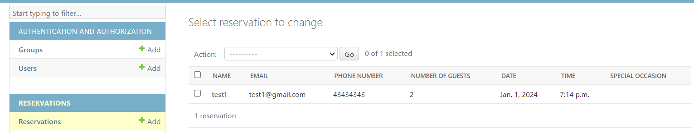

### Testing reservation inputs 

multiple tests have been performed to check the reservations form works correctly.

- Phone number has to be numeric *The letter e can be entered into the IntergerField fo some reason. Maybe because e is a number *
- Date starts at todays date.
- time intervals are set to every 15 minutes
- Number of people is capped betweeen 1-8
- Email has to be an email because of EmailField

### Testing double booking 

THIS WILL BE DONE AT A LATER DATE.

## Authentication 

Click me

Check allauth working with nav links. Allauth did the hard work for signup/login/logout. Just had to configure navbar.html with Django templates to check authentication. A test account was created to check it worked.

 Not logged in shows this view:

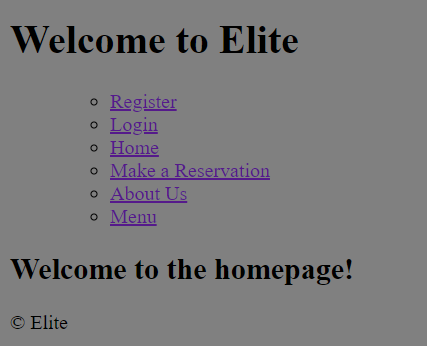

 signing up shows:

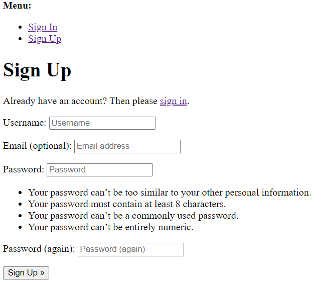

 Logged in shows:

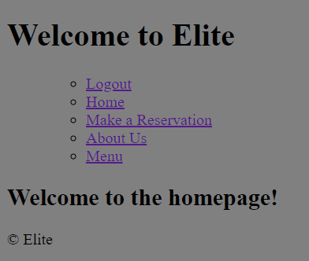

To make users log in before making a reservation. The following code was added:

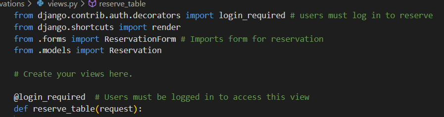

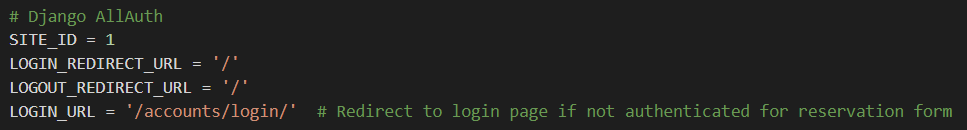

Now when a non authenticated user trys to reserve they are redirected to log in page

## Linking reservations to user accounts.

Click me

This didn't go very well. I updated code to link the reservations:

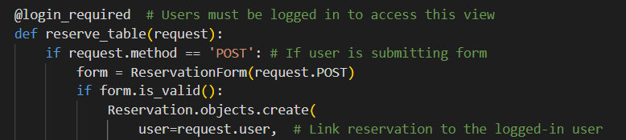

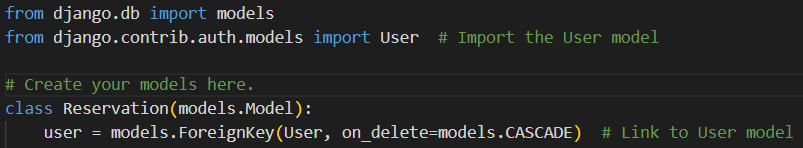

After this i tried to migrate but forgot that now there are empty fields. I dropped my reservation database and created a new version. this threw an error when accessing the reservation model from the admin page:

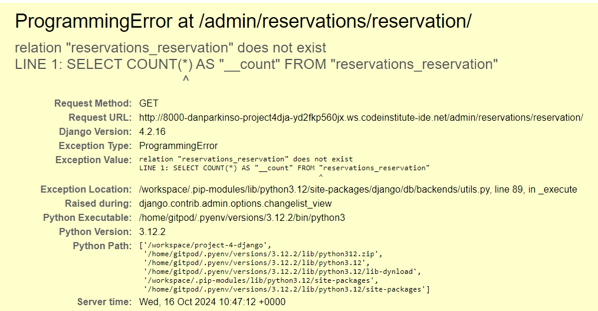

I contacted student support who advised me to change to the sqlite3 database from now on and remigrate to a postgreSQL databse later on when my models are finished.

To test that the users are connected to the reservation I now need to create some users, reservations and a html page called user_reservations to be able to view them. 

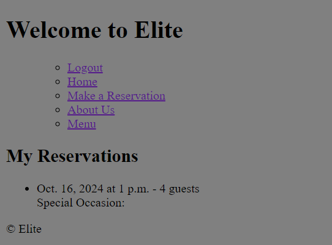

## Edit a reservation

Click me

Users can now edit reservations. 

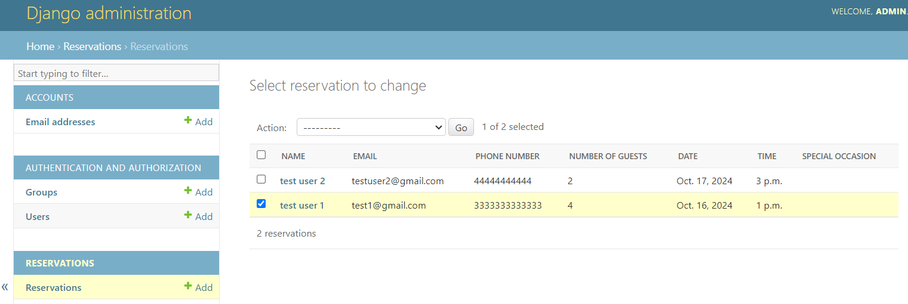

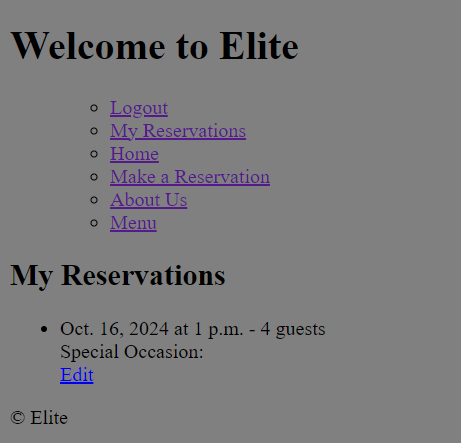

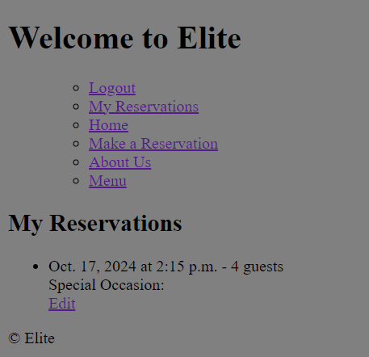

To allow me to edit the reservation I had to:

- Create an edit_reservation view to handle the request
- Update my reservation form to a ModelForm which allows it access the database. It needs to this because of the instance in the edit_reservation view that pre populates the information in the form. ModelForms need a class meta.
- Edit the my_reservation.html for loop that loads reservations to have an edit button that links to the unique reservation_id that django creates. 

## Delete reservation 

Click me

Users can now delete reservations 

Multiple reservation for one user

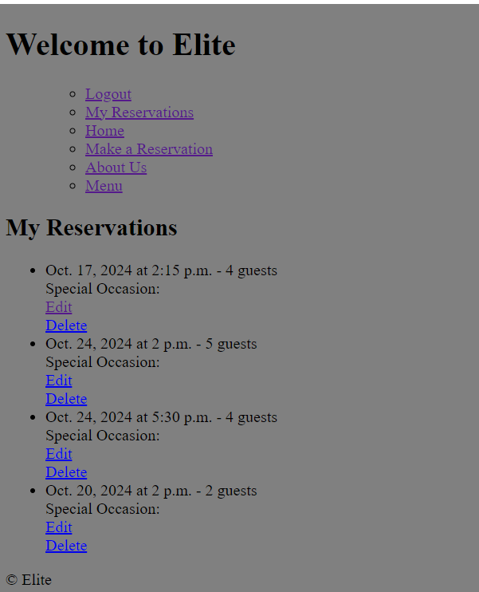

When pressing delete user is linked to delete confirmation page 

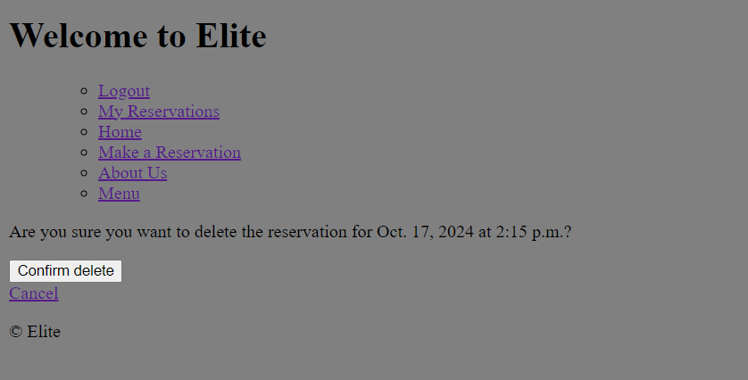

When pressing confirm user is redirected to my_reservations and the reervations is deleted.

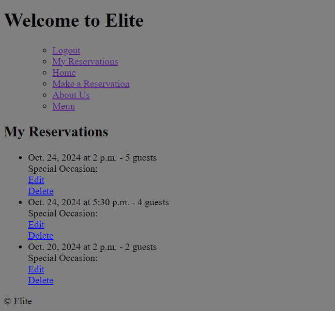

The admin page shows the reservation was successfully deleted form the database

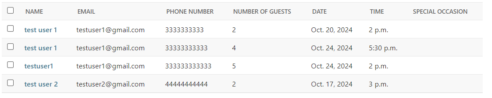

## Reservations to show in time order on my_reservations

Click me

Reservations now show in time order

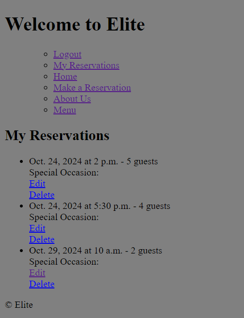

## Homepage shows the latest reservation

Click me

logged in users without next reservation see:

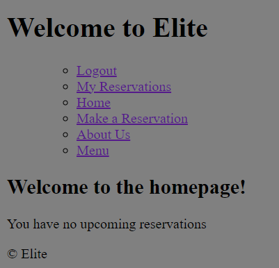

logged in users with a reservation see: 

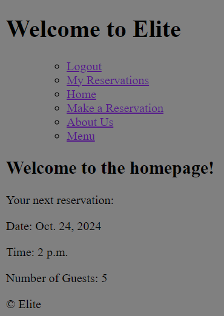

Non logged in users see:

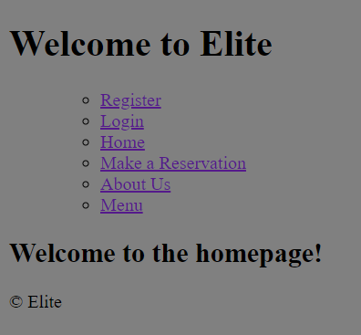

## reservations update display when reservation passed booking time.

Click me

A user has this booking. I need to wait and see if their booking updates to their next reservation after the time slot has passed.

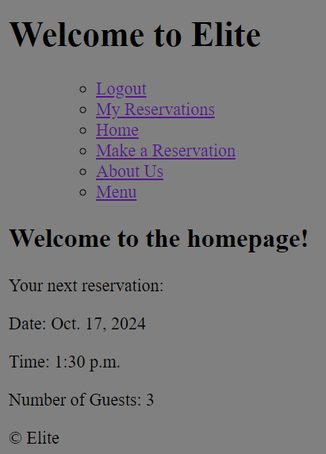

- The reservation does not remove when the time is passed. this will be the next thing to focus on. 

- my_reservations updated for deleting expired reservations. 

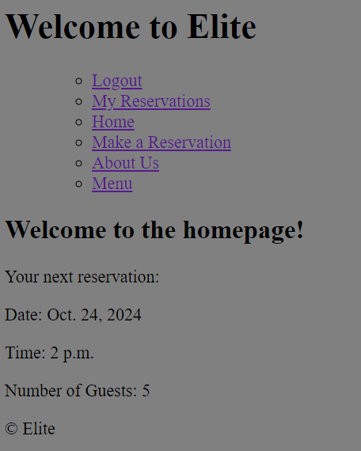

This took a long time because I was over complicating the code. simple plans are always best!

