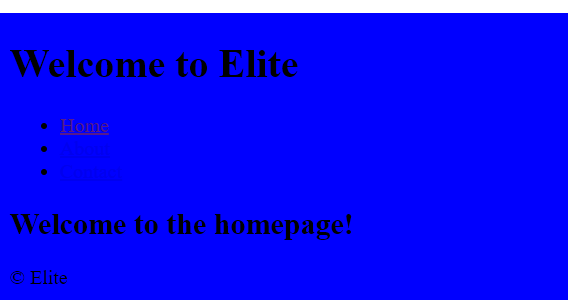
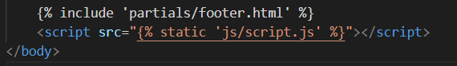

# TESTING

A variety of exploratory tests were performed throughout the project.

## MANUAL TESTING

Getting the live deployed site working. This is well documented in the latter sections of [DEPLOYMENT.md](DEPLOYMENT.md)

## Checking website loads hompage

Click me

Add the following code to the home/views.py file. This tells the server to display "This is the homepage"

Add the following code to the elite_cuisine/urls.py file.

Add the following code to the elite_cuisine/settings.py file to installed apps.

Use command python3 manage.py runserver to check the home app is linked correctly.

## Super User

Click me

When i originally tried to login as a superuser i recieved this error.

After using code institute support i had forgotten to add.

Admin login now functions correctly.

## Creating Templates 

Click me

Create a top level directory to include your templates 

connect the templates directory to *elite/settings.py*

Once the templates partials are populated. The server looks like this

## Connecting CSS and JS

Click me

Connect the static directory to *elite/settings.py*.

Create you style.css as shown at the top level.

Edit head.html to load sytle sheet.

I initally recieved the error below. After chaging *STATIC_URL = '/static/'* in elite/setting.py the style sheet connected.

Server with backgorund colour.

Create script.js in static directory.

Connect script.js to base.html.

Check server loads message in developer tools.

## Reservations app 

Click me

First I created the form to be able to submit a reservation and a success page

Now to create the link to the database. 

And to style the admin display so it is clearer

